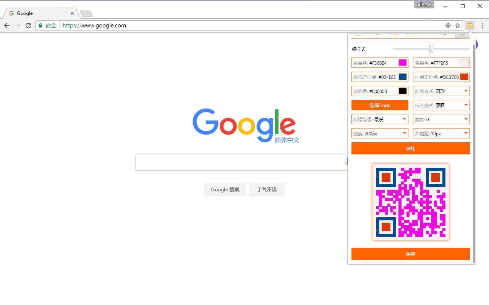

## awesome-qrcode-extension
#### chrome上的二维码插件


[Google商店地址-还没有](https://chrome.google.com/webstore/detail/qrcode-generator/fdpanjjjnjopokhncmliffkcnnhjaiec)

#### 预览



#### 项目

下载&安装

```
git clone https://github.com/wxul/awesome-qrcode-extension.git
cd awesome-qrcode-extension/
yarn
```

构建

```
npm run build
```

打包

```
npm run pack        打包为chrome插件的crx格式
npm run zip         打包为zip格式
```

其它
```
npm run analyzer    代码分析
```